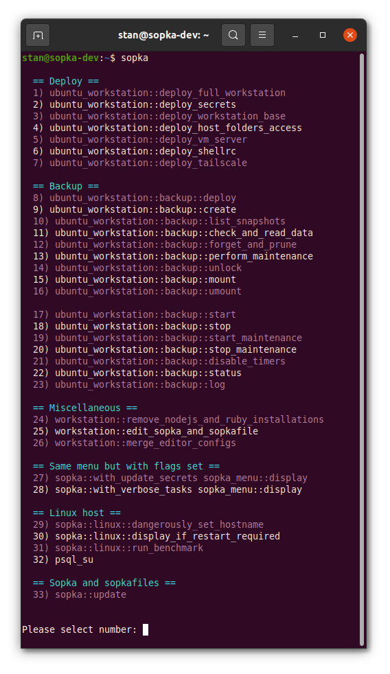

<!--
Copyright 2012-2022 Stanislav Senotrusov <stan@senotrusov.com>

Licensed under the Apache License, Version 2.0 (the "License");
you may not use this file except in compliance with the License.
You may obtain a copy of the License at

    http://www.apache.org/licenses/LICENSE-2.0

Unless required by applicable law or agreed to in writing, software
distributed under the License is distributed on an "AS IS" BASIS,
WITHOUT WARRANTIES OR CONDITIONS OF ANY KIND, either express or implied.
See the License for the specific language governing permissions and
limitations under the License.
-->
# 🚞 Sopkafile to configure my workstation

A script to configure my workstation. I run it on a freshly installed Linux, MacOS, or Windows.

This script helps me to configure my workstation, but it's rather generic and could also be useful for other people.

Still, it contains steps which are of personal preference and needs.

To keep those steps as declarative as I could possible express in Bash, I made a separate library [Sopka](https://github.com/senotrusov/sopka).

Basically, this Sopkafile you are looking at is the things I want to setup and configure for that exact task (my workstation) and [Sopka](https://github.com/senotrusov/sopka) is the abstract library that makes it all possible.



## What this script will do

1. Installs the basic software I frequently use.
2. Installs keys and software licenses from my bitwarden database.
3. Makes a few tweaks to the system and to the desktop software.
4. Installs a few shell aliases.
5. Installs configuration for the Sublime Text and Visual Studio Code (there is also a script to keep configuration in the repository up to date with the local changes).

This script is idempotent. It can be run multiple times to produce a system which is up-to date with the recent software updates and with my configuration changes.

The file ``config.sh`` contains my name and email to use in configuration. Please remove them if you happen to fork this script.

## How to run it

### on Linux

#### Option A: if you have a console with scrollbuffer

```sh
bash <(wget -qO- https://raw.githubusercontent.com/senotrusov/sopka/main/deploy.sh) add senotrusov/sopkafile run
```

#### Option B: run deploy-vm-server on console without scroll buffer

```sh
bash <(wget -qO- https://raw.githubusercontent.com/senotrusov/sopka/main/deploy.sh) add senotrusov/sopkafile run ubuntu_workstation::deploy-vm-server 2>&1 | tee -a deploy-vm-server.log
```

### on MacOS

```sh
bash <(curl -Ssf https://raw.githubusercontent.com/senotrusov/sopka/main/deploy.sh) add senotrusov/sopkafile run
```

### on Windows

#### 1. First stage deploy script (in powershell)

Start PowerShell as administrator, run the following and wait for it to complete:

```sh
iwr -UseBasicParsing "https://raw.githubusercontent.com/senotrusov/sopkafile/main/deploy.ps1" | iex
```

That script will do the following:

1. Installs chocolatey
2. Installs git
3. Clones [sopka](https://github.com/senotrusov/sopka) and [sopkafile](https://github.com/senotrusov/sopkafile) repositories
4. Installs packages from those lists:
    * [bare-metal-desktop.config](lib/choco/bare-metal-desktop.config) (if not in virtual machine)
    * [developer-tools.config](lib/choco/developer-tools.config) (you will be asked if it's needed)
    * [basic-tools.config](lib/choco/basic-tools.config)
7. Upgrades all installed choco packages
8. Sets ssh-agent service startup type to automatic and runs in

#### 2. Second stage deploy script (in bash)

At this point, Git Bash should be installed by the first script. Start Git Bash as your regular user and run the following:

```sh
~/.sopka/bin/sopka
```

Select ``windows_workstation::deploy``. It will do the following:

1. Installs shellrc loader
2. Selects nano as default editor
3. Adds sopka to PATH
4. Configures git, vscode, sublime merge, sublime text
5. Installs ssh keys, rubygems and npm credentials

#### 3. Set execution policy to "Bypass"

Start PowerShell as a regular user, and make sure you really understand consequences of the next command before you run it:

```sh
Set-ExecutionPolicy -ExecutionPolicy Bypass -Scope CurrentUser -Force
```

#### 4. Install winssh-pageant

https://github.com/ndbeals/winssh-pageant

## Secret items which are expected to be found in a Bitwarden

Record names should be as the following:

```
"my data server ssh destination"
"my data server ssh private key"
"my data server ssh public key"
"my github personal access token"
"my workstation virtual machine host filesystem access credentials"
"my password for ssh private key"
"my rubygems credentials"
"my ssh private key"
"my ssh public key"
"my tailscale reusable key"
"my sublime text 3 license"
```

## Contributing

Please check shell scripts before commiting any changes with `npm run lint`.
